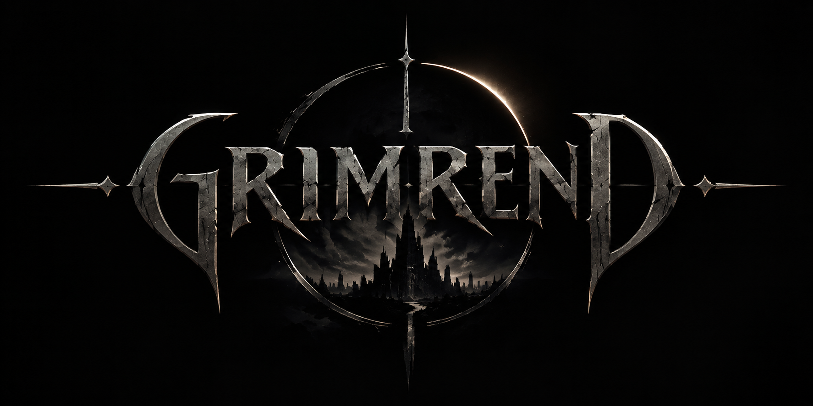

<div align="center">

<!-- Logo provisório -->


# Grimrend *(título e logo provisório)*

**Um action roguelite 2D top-down de dark fantasy, com hordas, progressão viciante e combate brutal.**


-blue)

</div>

> ⚠️ **Projeto em fase inicial.** Este repositório documenta um projeto que está no começo do planejamento. As decisões de design, as funcionalidades e a forma como tudo deve funcionar descritas aqui são a **versão atual da ideia** e podem mudar bastante ao longo do desenvolvimento.

---

## Sumário

1. [Sobre o projeto](#sobre-o-projeto)
2. [Inspirações e diferencial](#inspirações-e-diferencial)
3. [Conceito do jogo](#conceito-do-jogo)
4. [Escopo do MVP](#escopo-do-mvp)
5. [Funcionalidades futuras (pós-MVP)](#funcionalidades-futuras-pós-mvp)
6. [Escopo final (visão 1.0)](#escopo-final-visão-10)
7. [Requisitos](#requisitos)
8. [Stack de tecnologia](#stack-de-tecnologia)
9. [Metodologia de desenvolvimento](#metodologia-de-desenvolvimento)
10. [Roadmap](#roadmap)
11. [Estrutura do repositório](#estrutura-do-repositório)
12. [Documentação e artefatos de engenharia](#documentação-e-artefatos-de-engenharia)
13. [Boas práticas e desenvolvimento seguro](#boas-práticas-e-desenvolvimento-seguro)
14. [Plataformas e distribuição](#plataformas-e-distribuição)
15. [Como executar](#como-executar)
16. [Licença e créditos](#licença-e-créditos)
17. [Autor](#autor)

---

## Sobre o projeto

Este repositório contém o projeto individual da disciplina de **Engenharia de Software**, cujo objetivo é aplicar, em um projeto pessoal, os conceitos da área aprendidos até aqui: levantamento de requisitos, modelagem (UML), modelagem de dados, escolha de metodologia, planejamento por roadmap, organização de repositório e boas práticas de desenvolvimento seguro.

O software escolhido é um **jogo digital**, desenvolvido por uma única pessoa, com a ideia de poder evoluir no futuro para um produto real, publicado na Steam. Por isso o projeto é tratado desde o início como um software de verdade: com escopo definido, MVP, roadmap e documentação.

## Inspirações e diferencial

- **Vampire Survivors**: progressão rápida, hordas crescentes e o ciclo "mais um nível, mais uma partida".
- **Doom**: ritmo agressivo, combate brutal, sangue e sensação de poder (*power fantasy*).

**Diferencial planejado:** mistura dessas duas referências com **mira manual**, armas de fogo e corpo a corpo, **gore com sistema de desmembramento** e efeitos nos inimigos (pós-MVP), grande variedade de inimigos e armas, e builds com combinações realmente diferentes.

## Conceito do jogo

- **Gênero:** action roguelite / survivors-like, 2D, visão de cima (*top-down*).
- **Ambientação:** dark fantasy, com inimigos como goblins, ogros, aranhas mutantes e criaturas fantásticas (humanos também podem ser inimigos). O foco é em **armas comuns** (facas, espadas, armas de fogo) em vez de magias.
- **Loop principal:** enfrentar hordas → ganhar XP por kill e por ações → subir de nível → escolher habilidades → enfrentar inimigos mais fortes e em maior número → bosses.
- **Curva de dificuldade:** começa leve para o jogador aprender; sobe até travar o jogador; o jogador evolui (XP, armas, habilidades) e se sente forte, até um novo obstáculo surgir. A dificuldade oscila de propósito, com momentos difíceis e momentos muito fáceis.
- **Variedade como estratégia anti-monotonia:** muitos tipos de inimigos, muitas armas e builds. Armas do início não ficam obsoletas no fim, e existem armas e habilidades muito fortes para o jogador descobrir por conta própria.
- **Controles previstos:** movimento com **WASD**, mira com o **mouse** (independente da direção do movimento), ataque com o botão do mouse. Suporte a controle (analógico direito para mirar) planejado para o futuro.

### Estrutura de fases e progressão *(versão atual, sujeita a mudanças)*

- **Fases com checkpoint:** o início de cada fase é um checkpoint. Uma fase pode ter um boss, mais de um ou nenhum.
- **Conclusão da fase:** o jogador precisa chegar a um ponto de saída, liberado ao cumprir os objetivos da fase (derrotar um boss, realizar ações específicas, eliminar todos os inimigos, etc.). Depois de cumprir os objetivos, o jogador pode continuar na fase ganhando XP antes de sair.
- **Equipamento por fase:** ao entrar em uma nova fase, o equipamento volta ao padrão daquela fase (não carrega o que foi usado na anterior). Cada fase funciona como uma mini-partida: começar fraco, evoluir, se sentir forte e encontrar um novo obstáculo.
- **Habilidades temporárias:** os pontos de habilidade ganhos ao subir de nível são gastos na árvore de habilidades (melhorias e novas habilidades); valem apenas na fase atual.
- **Habilidades permanentes:** concedidas como pontos permanentes ao cumprir objetivos específicos (bosses derrotados, fases concluídas). O ponto é concedido uma única vez por objetivo; repetir a fase não concede de novo. Uma fase pode conceder vários pontos (a quantidade será definida depois). Os pontos podem ser gastos a qualquer momento da partida, na área de habilidades permanentes da árvore de habilidades (aberta pelo menu de pausa).
- **Morte não punitiva:** ao morrer, o jogador volta ao início da fase atual, mantendo os pontos permanentes já conquistados (gastos ou não), voltando mais forte.
- **Nível e XP:** resetam a cada fase. Apenas os pontos permanentes (e as habilidades permanentes adquiridas com eles) são mantidos.
- **Salvamento:** no MVP, automático (periodicamente e ao concluir objetivos específicos). Registra o progresso geral, como a fase atual, os pontos permanentes e os objetivos já concluídos. O salvamento manual de verdade (em qualquer momento) e a retomada da fase exatamente de onde parou ficam para depois do MVP.
- **Evolução futura:** progressão híbrida, com base, moedas e melhorias permanentes, além da escolha do equipamento inicial entre os já desbloqueados.

### Interface e feedback de combate

- **HUD moderna:** barra de vida comprida e estilizada (vermelha), posicionada em um canto da tela junto com as demais informações (nível/XP, munição). Evita HUD pixelada, centralizada ou apenas com números.
- **Números de dano flutuantes** ao causar dano, com destaque visual para dano crítico e para cada tipo de dano. Valores grandes são abreviados (estilo jogos idle, ex.: 1,2K, 3,4M). Debuffs estão previstos para depois do MVP.

### Menus e navegação *(versão atual, sujeita a mudanças)*

| Menu | No MVP | Depois do MVP |
|---|---|---|
| Menu principal | Novo jogo, Continuar (abre o último save) e Sair do jogo | Carregar jogo (escolher entre vários saves) e Configurações |
| Menu de pausa (durante a partida) | Retomar, Árvore de habilidades, Ajustar volume, Voltar ao menu principal e Sair do jogo | Configurações e Status completo do personagem |
| Seleção de fase | – | Escolher qual fase jogar, usando os dados de um save |
| Configurações | – | Áudio detalhado (no MVP há só um controle simples de volume no menu de pausa), gráficos, jogabilidade e comandos (teclas, controle e mouse), no menu principal e no de pausa |

- **Árvore de habilidades:** é ramificada. O jogador começa em pontos específicos e vai liberando as habilidades vizinhas. As habilidades temporárias ficam na árvore principal, e as permanentes, que o jogador pode adquirir e melhorar, aparecem em uma área separada (por exemplo, na parte de baixo da tela). A árvore só pode ser aberta pelo menu de pausa, dentro de uma partida com save válido, e **nunca pelo menu principal**.
- **Continuar:** carrega o último save (no MVP, o automático; depois, o último entre manual e automático). **Novo jogo** cria um novo save; se já existir um save, o jogo pede confirmação antes de sobrescrevê-lo (há um único save no MVP).
- **Sair do jogo:** fecha o jogo e volta direto para o desktop, tanto pelo menu principal quanto pelo de pausa.
- **Voltar ao menu principal** e **Sair do jogo** (pelo menu de pausa): como o estado no meio da fase não é salvo no MVP, o jogo avisa antes que o progresso da fase atual será perdido, e ao continuar depois o jogador retoma do início da fase.
- **Seleção de fase** (futuro): permite revisitar fases usando os dados de um save, trocar itens de conta permanentes no início da missão ou na base e farmar moedas. Ela também abre caminho para desbloqueios de endgame, como o New Game+.

## Escopo do MVP

O MVP deve responder uma pergunta: **o núcleo do jogo é divertido?** Ele inclui somente:

| Área | Funcionalidade |
|---|---|
| Jogador | Movimento, mira manual com o mouse, barra de HP, munição |
| Combate | 4 armas básicas (corpo a corpo e de fogo) |
| Inimigos | 5 tipos de inimigos com comportamentos simples |
| Progressão | Sistema de XP, níveis e árvore de habilidades ramificada simples (6 temporárias e 4 permanentes) |
| Conteúdo | 3 fases, 2 mini bosses e 1 boss |
| Menus | Menu principal (Novo jogo, Continuar, Sair do jogo) e menu de pausa (retomar, árvore de habilidades, ajustar volume, voltar ao menu principal, sair do jogo) |
| Fluxo | Checkpoint no início de cada fase, tela de morte e reinício da fase |
| Drops | Armas encontradas no caminho |
| Interface | HUD moderna: barra de vida e demais informações em um canto da tela |
| Feedback de combate | Números de dano flutuantes, com abreviação de valores grandes |
| Som | Sons básicos (ataques, dano e interface) e controle simples de volume no menu de pausa |
| Dano | Dano crítico e dois tipos de dano: físico e fogo |
| Save | Salvamento automático (periódico e ao concluir objetivos) |

**O MVP estará concluído quando:**

- [ ] As 3 fases puderem ser jogadas do início ao fim, com checkpoint no início de cada uma.
- [ ] Existirem 5 tipos de inimigos, 2 mini bosses e 1 boss.
- [ ] Existirem 4 armas utilizáveis (corpo a corpo e de fogo).
- [ ] O jogador subir de nível e gastar pontos na árvore de habilidades (temporárias e permanentes) pelo menu de pausa.
- [ ] O menu principal (Novo jogo, Continuar, Sair do jogo) e o menu de pausa funcionarem.
- [ ] O jogo tiver sons básicos (ataques, dano e interface) e controle de volume no menu de pausa.
- [ ] A HUD, os números de dano, o dano crítico e os dois tipos de dano (físico e fogo) funcionarem.
- [ ] O progresso for salvo automaticamente.

**Fora do MVP, de propósito:** base principal, moedas (*coins*), traders, NPCs, armas automáticas, lore e diálogos, desmembramento, buffs e debuffs, além de carregar jogo, configurações completas, status completo do personagem, seleção de fase e trilha musical. Tudo isso está listado abaixo.

## Funcionalidades futuras (pós-MVP)

Planejadas, mas **não** fazem parte do MVP:

- **Base principal (*hub*)**: local para conversar com NPCs importantes, acessar funcionalidades extras e personalização. Pode ser introduzida a partir da 3ª ou 4ª fase.
- **Moedas (*coins*)** obtidas de inimigos mortos, baús ou outra mecânica mais imersiva, e **traders** (comerciantes) para comprar armas e itens.
- **NPCs** com diálogos, inclusive aliados que ajudam o protagonista (não necessariamente humanos).
- **Lore e história** simples, com diálogos sem voz (no máximo grunhidos ou sons simples).
- **Desmembramento e gore avançado**: feedback visual realista ao ferir inimigos, com **debuffs** específicos (por exemplo, inimigo ferido na perna fica mais lento).
- **Sistema completo de buffs e debuffs**, para o jogador e para os inimigos.
- **Armas automatizadas** no endgame (por exemplo, arma acoplada à armadura que usa IA para mirar e atirar: metralhadoras, lança-mísseis).
- **Mais tipos de inimigos, armas, habilidades e builds**, além de mais bosses e mini bosses.
- **Personalização** do personagem e, talvez, mais de um personagem jogável (a avaliar, pois aumenta bastante a complexidade).
- **Salvamento manual** em qualquer momento e **retomar a fase exatamente de onde parou**, salvando o estado completo da fase no meio da partida.
- **Carregar jogo** (vários saves, junto com o salvamento manual); a opção **Continuar** passa a abrir o último save, manual ou automático.
- **Menu de configurações** (no menu principal e no de pausa), com submenus de áudio, gráficos, jogabilidade e comandos (teclas, controle e mouse).
- **Status completo do personagem**, com os valores já calculados, acessível pelo menu de pausa.
- **Seleção de fase**: escolher qual fase jogar usando os dados de um save, para revisitar fases, trocar itens de conta permanentes no início da missão ou na base e farmar moedas.
- **New Game+** e outros desbloqueios de endgame.
- **Suporte a controle** (gamepad) e possível compatibilidade com Steam Deck.
- **Conquistas, trilha sonora e efeitos sonoros** mais elaborados.

## Escopo final (visão 1.0)

Quando finalizado, o jogo completo terá:

- Campanha com várias fases, cada uma com mais inimigos, novos tipos e novos desafios.
- Grande variedade de inimigos, mini bosses e bosses.
- Arsenal amplo: armas corpo a corpo, armas de fogo e armas automatizadas de endgame, com armas "quebradas" secretas.
- Progressão por XP, níveis, habilidades e builds variadas.
- Base principal com NPCs, traders, personalização e funcionalidades extras.
- Lore simples com diálogos.
- Salvamento automático e manual, com carregar jogo e continuar.
- Menus completos: configurações, status do personagem e seleção de fase.
- New Game+ e desbloqueios de endgame.
- Sistema de gore e desmembramento com efeitos de gameplay.
- Sistema de buffs e debuffs.
- Lançamento na **Steam para Windows**, com preço de jogo indie de baixo orçamento.

Ports para outras plataformas só serão considerados dependendo do sucesso do lançamento inicial.

## Requisitos

### Requisitos funcionais (MVP)

| ID | Requisito |
|---|---|
| RF01 | O jogador deve poder se mover pelo mapa com o teclado |
| RF02 | O jogador deve poder mirar e atacar usando o mouse |
| RF03 | O jogo deve exibir HP e munição do jogador |
| RF04 | O jogo deve gerar inimigos em quantidade e variedade crescentes |
| RF05 | O jogador deve ganhar XP ao derrotar inimigos e subir de nível |
| RF06 | O jogador deve ganhar pontos de habilidade ao subir de nível e gastá-los na árvore de habilidades (habilidades temporárias) |
| RF07 | O jogo deve ter fases com mini bosses e um boss |
| RF08 | O jogador deve poder encontrar armas durante a partida |
| RF09 | O jogo deve exibir tela de morte e permitir reiniciar |
| RF10 | O jogo deve ter menu principal com Novo jogo, Continuar (último save) e Sair do jogo |
| RF11 | O jogo deve exibir uma HUD moderna com barra de vida, XP/nível e munição |
| RF12 | O jogo deve exibir números de dano flutuantes ao causar dano |
| RF13 | Cada fase deve ter checkpoint no início, e o jogador deve reiniciar a fase atual ao morrer |
| RF14 | O jogador deve receber pontos de habilidade permanentes ao cumprir objetivos específicos |
| RF15 | O jogador deve poder gastar pontos permanentes na árvore de habilidades, pelo menu de pausa, a qualquer momento da partida |
| RF16 | O jogo deve ter dano crítico e dois tipos de dano (físico e fogo), com feedback visual distinto |
| RF17 | O jogo deve salvar o progresso automaticamente (periodicamente e ao concluir objetivos) |
| RF18 | O jogador deve poder pausar a partida e acessar o menu de pausa (árvore de habilidades, ajuste de volume, voltar ao menu principal e sair do jogo) |
| RF19 | A árvore de habilidades só deve ser acessível dentro de uma partida com save válido, nunca pelo menu principal |
| RF20 | O jogo deve reproduzir sons básicos (ataques, dano e interface) |
| RF21 | O jogador deve poder ajustar o volume geral pelo menu de pausa |
| RF22 | Ao iniciar um Novo jogo com um save existente, o jogo deve pedir confirmação antes de sobrescrevê-lo |
| RF23 | Ao voltar ao menu principal ou sair durante uma fase, o jogo deve avisar que o progresso da fase atual será perdido |

### Requisitos não funcionais

| ID | Requisito |
|---|---|
| RNF01 | Rodar de forma fluida em PCs modestos com Windows (meta: 60 FPS) |
| RNF02 | Código organizado, versionado e documentado |
| RNF03 | Dados do jogo (armas, inimigos, habilidades) separados do código, para facilitar balanceamento |
| RNF04 | Apenas assets com licença livre ou próprios, com créditos registrados |
| RNF05 | Salvamento de dados com validação para evitar corrupção ou adulteração simples |

## Stack de tecnologia

| Tecnologia | Uso |
|---|---|
|  | Engine do jogo (versão gratuita) |
|  | Linguagem de programação |
|   | Versionamento e hospedagem do repositório |
|  | Editor de código *(ou Visual Studio / Rider)* |
|  | Sistema operacional de destino do jogo (PC) |
|  | Plataforma de distribuição e lançamento do jogo (planejado) |
|  | Diagramas UML em Markdown (sequência e atividades); casos de uso em PDF |

### Armazenamento de dados

O jogo é **single-player e offline**, então **não usa um servidor de banco de dados** (como o MySQL) no MVP. Os dados de progresso (saves) ficam em arquivos locais (por exemplo, JSON), e os dados do jogo (armas, inimigos, habilidades) ficam em `ScriptableObjects` do Unity ou em arquivos de dados.

O "banco de dados" modelado em `docs/database/` é o **modelo de dados** do jogo: quais entidades existem (armas, inimigos, habilidades, save) e como elas se relacionam. Um banco de dados real só seria considerado se houver recursos online no futuro (contas, ranking, saves na nuvem), e nesse caso seria acessado por um servidor intermediário (API), nunca diretamente pelo jogo.

## Metodologia de desenvolvimento

A metodologia do projeto será **ágil**, em formato **Kanban**, com ciclos curtos inspirados no Scrum, adaptados para desenvolvimento individual.

**Por que ágil?** Em um jogo, o que é divertido só se descobre jogando, e os requisitos mudam conforme o protótipo evolui. Metodologias sequenciais, como cascata, não permitem voltar atrás com facilidade. O Kanban funciona bem para uma pessoa só: o quadro de tarefas (GitHub Projects) terá as colunas *Backlog → Em andamento → Em teste → Concluído*, com limite de tarefas em andamento para evitar dispersão. Esta e outras decisões importantes estão registradas em [`docs/decisoes/`](docs/decisoes/).

## Roadmap

### MVP

- [ ] **v0.1 – Núcleo jogável:** movimento, mira com mouse, uma arma corpo a corpo e uma de fogo, 2 ou 3 inimigos, HP e munição, HUD moderna, números de dano flutuantes, dano crítico e dois tipos de dano (físico e fogo), morte e reinício.
- [ ] **v0.2 – Progressão e variedade:** XP, níveis, árvore de habilidades simples (temporárias e permanentes), inimigos até chegar a 5 tipos, drops de armas (4 armas no total), salvamento automático.
- [ ] **v0.3 – Conteúdo do MVP:** 3 fases com checkpoint, 2 mini bosses, 1 boss, menu principal e menu de pausa, sons básicos e controle de volume. **Fim do MVP.**

### Pós-MVP

- [ ] **v0.4 – Economia e base:** moedas, base principal, traders, seleção de fase e itens de conta permanentes.
- [ ] **v0.5 – Narrativa:** NPCs, diálogos e lore simples.
- [ ] **v0.6 – Brutalidade:** desmembramento, efeitos visuais de gore, buffs e debuffs.
- [ ] **v0.7 – Endgame:** armas automatizadas, mais armas, mais bosses e New Game+.
- [ ] **v0.8 – Polimento:** balanceamento, trilha musical, sons mais elaborados, suporte a controle, salvamento manual, carregar jogo, configurações e status do personagem.
- [ ] **v1.0 – Lançamento:** publicação na Steam (Windows).

## Estrutura do repositório

```
.
├── docs/
│   ├── assets/       # Logo e imagens da documentação
│   ├── decisoes/     # Registros de decisões de arquitetura (ADR)
│   ├── diagrams/     # UML: casos de uso, sequência e atividades
│   ├── database/     # Modelo de dados (planilha: link e exportação)
│   └── prototype/    # Protótipo de telas
├── src/              # Código-fonte: projeto Unity (Assets, Packages, ProjectSettings)
├── tests/            # Plano e casos de teste
└── README.md
```

A organização interna de `src/` (scripts, prefabs, cenas, arte e áudio) será detalhada conforme o jogo evoluir.

## Documentação e artefatos de engenharia

| Artefato | Local | Status |
|---|---|---|
| Diagrama de casos de uso (PDF) | `docs/diagrams/` | Rascunho |
| Diagrama de sequência (Mermaid) | `docs/diagrams/` | A fazer |
| Diagrama de atividades | `docs/diagrams/` | A fazer |
| Modelo de dados (planilha) | `docs/database/` | A fazer |
| Protótipo de telas | `docs/prototype/` | A fazer |
| Roadmap do MVP | Este README | Rascunho |
| Metodologia | Este README | Rascunho |
| Registros de decisões (ADR) | `docs/decisoes/` | Rascunho |

## Boas práticas e desenvolvimento seguro

- **Controle de versão:** commits pequenos e descritivos (Conventional Commits), branch `main` estável, branch `develop` para o desenvolvimento e branches por funcionalidade quando necessário.
- **Sem segredos no repositório:** nenhuma chave, senha ou token versionado; `.gitignore` adequado ao Unity.
- **Validação de dados:** entradas do jogador e arquivos de save são validados, nunca assumidos como confiáveis (versão do save, checagem de integridade).
- **Dados separados do código:** parâmetros de jogo em `ScriptableObjects`, o que evita números mágicos espalhados.
- **Código limpo:** responsabilidades separadas por pasta, nomes claros, componentes pequenos e reutilizáveis.
- **Dependências e assets:** uso apenas de conteúdo com licença livre, registrado em `CREDITS.md` com autor e licença de cada item.
- **Testes:** testes automatizados para regras de jogo importantes (XP, dano, progressão) conforme o projeto evolui.
- **Conteúdo sensível:** o jogo tem violência e gore; a classificação indicativa e o questionário de conteúdo da Steam serão tratados antes de qualquer lançamento.

## Plataformas e distribuição

- **Plataforma inicial:** Windows (PC), publicado na **Steam**.
- **Preço:** baixo, compatível com jogos indie de baixo orçamento.
- **Outras plataformas** (Steam Deck, consoles, etc.): avaliadas somente após o sucesso do lançamento inicial.

## Como executar

> Em construção. Quando houver um protótipo jogável:
>
> 1. Instale o **Unity Hub** e a versão do Unity indicada em `src/ProjectSettings/ProjectVersion.txt`.
> 2. Clone o repositório: `git clone https://github.com/Pall4dino/grimrend.git`
> 3. Abra a pasta `src/` pelo Unity Hub.
> 4. Abra a cena do menu principal e clique em **Play**.

## Licença e créditos

- **Código:** licença a definir.
- **Assets de terceiros:** cada um mantém sua licença original, listada em `CREDITS.md`.

## Autor

**Yuri Palladino** · [@Pall4dino](https://github.com/Pall4dino)

Projeto individual desenvolvido para a disciplina de Engenharia de Software.

---
