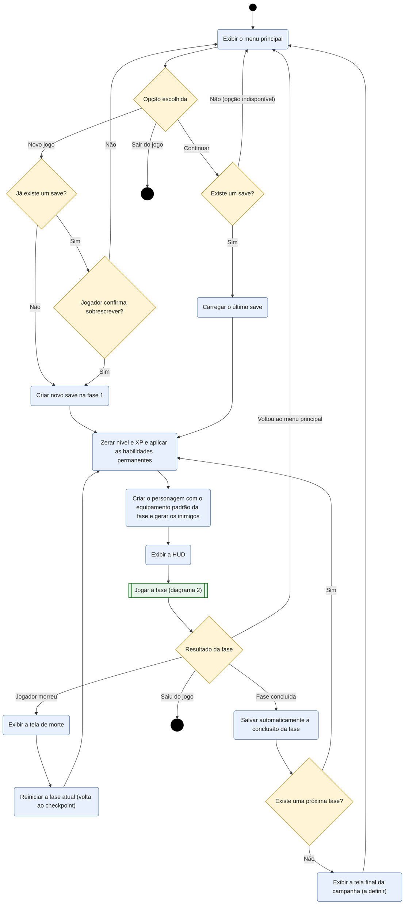
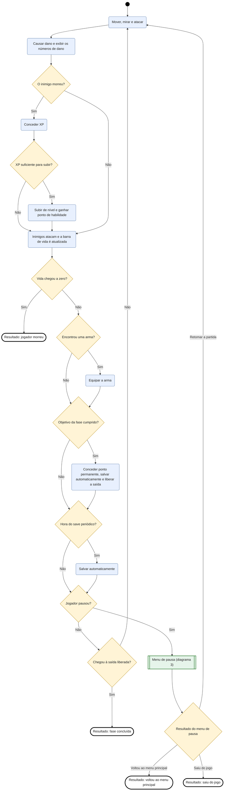
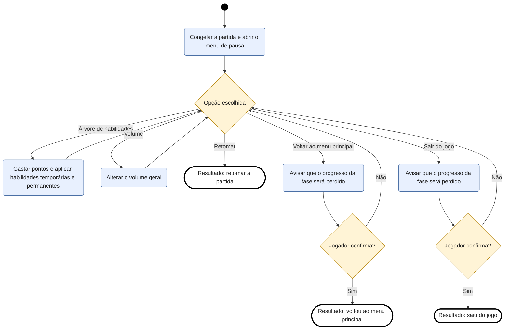

# Diagrama de atividades: fluxo do jogo (MVP)

Estes diagramas mostram a sequência de atividades do Grimrend, do menu principal até o fim de uma fase, dentro do escopo do MVP descrito no [README](../../README.md). Para ficarem legíveis, o fluxo foi dividido em três diagramas: o principal e duas subatividades.

## Como ler

O Mermaid não tem um diagrama de atividades nativo, então eles foram desenhados como fluxogramas, usando a notação da UML:

| Símbolo | Significado |
|---|---|
| Círculo preto (primeiro do diagrama) | Início |
| Círculo preto com anel | Fim |
| Retângulo azul de cantos arredondados | Atividade (algo que o jogo ou o jogador faz) |
| Losango amarelo | Decisão, com as condições escritas nas setas |
| Retângulo verde com bordas duplas | Subatividade, detalhada em outro diagrama |
| Retângulo branco de borda grossa | Resultado, ou seja, como a subatividade termina |

## 1. Fluxo geral

Do menu principal até o resultado de cada fase. A atividade "Jogar a fase" está detalhada no diagrama 2.

## 2. Jogar a fase

O ciclo que se repete durante a partida. Ele termina quando o jogador morre, conclui a fase, volta ao menu principal ou sai do jogo. A atividade "Menu de pausa" está detalhada no diagrama 3.

## 3. Menu de pausa

O que o jogador pode fazer ao pausar a partida. Ajustar o volume e usar a árvore de habilidades não saem do menu, e só retomar, voltar ao menu principal ou sair o encerram.

## Observações

- O salvamento periódico acontece em segundo plano no jogo real. Aqui ele aparece como uma verificação dentro do ciclo, para simplificar o desenho.
- O comportamento ao concluir a última fase ainda não foi definido, e por isso aparece como "Exibir a tela final da campanha (a definir)".
- Voltar ao menu principal ou sair durante uma fase faz o jogador perder o progresso daquela fase, porque o estado no meio da fase não é salvo no MVP.
- Itens fora do MVP (base, moedas, traders, salvamento manual, configurações, seleção de fase) não aparecem nestes diagramas.
