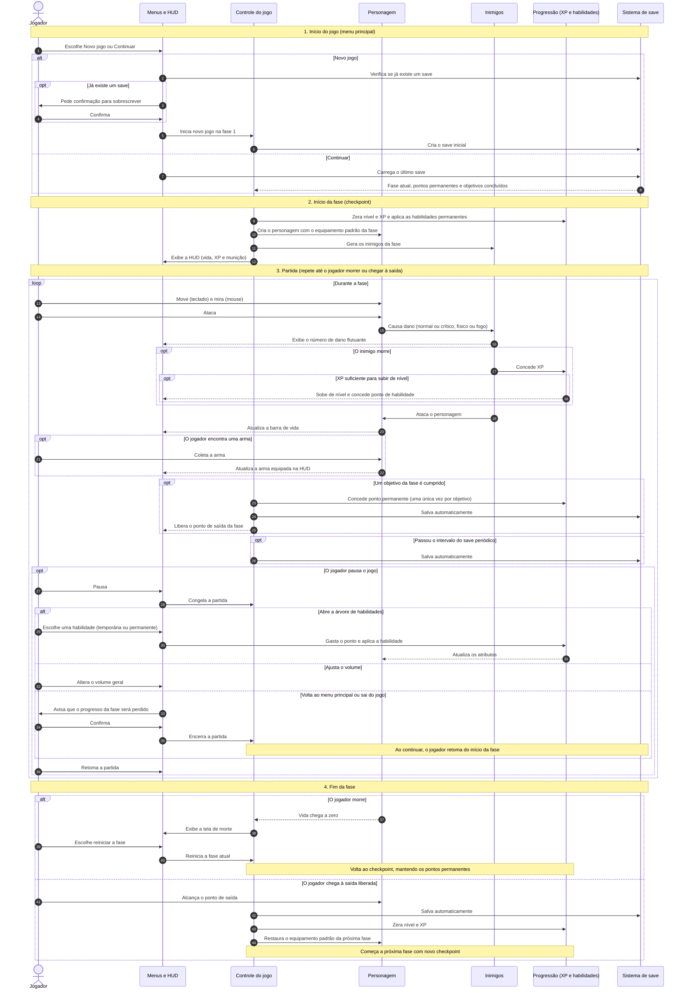

# Diagrama de sequência: fluxo principal do MVP

Este diagrama mostra como o Grimrend deve se comportar, do menu principal até o fim de uma fase. Ele cobre o escopo do MVP descrito no [README](../../README.md) e as decisões registradas em [`docs/decisoes/`](../decisoes/).

## Participantes

| Participante | O que representa |
|---|---|
| Jogador | Pessoa que joga |
| Menus e HUD | Menu principal, menu de pausa, árvore de habilidades e informações na tela |
| Controle do jogo | Lógica central: carrega fases, controla objetivos e checkpoints |
| Personagem | Personagem controlado pelo jogador (movimento, mira, ataque e vida) |
| Inimigos | Inimigos, mini bosses e boss da fase |
| Progressão (XP e habilidades) | XP, níveis, pontos de habilidade e habilidades temporárias e permanentes |
| Sistema de save | Salvamento automático do progresso geral |

## Diagrama

## Observações

- O salvamento é automático no MVP e guarda o progresso geral (fase atual, pontos permanentes e objetivos concluídos). O estado no meio da fase não é salvo.
- Ao morrer, o jogador volta ao início da fase atual, mantendo os pontos permanentes.
- Ao concluir uma fase, o equipamento volta ao padrão da próxima fase, e nível e XP são zerados.
- Itens fora do MVP (base, moedas, traders, salvamento manual, configurações, seleção de fase) não aparecem neste diagrama.
